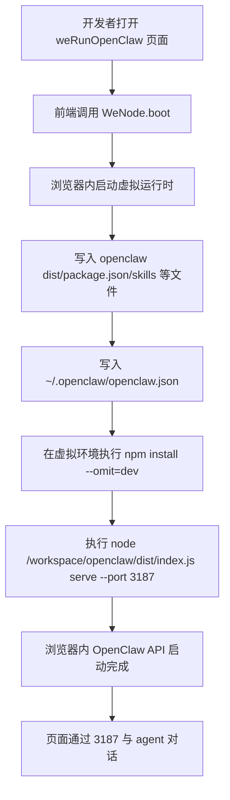

# BrowerClaw

中文 | [English](README_EN.md)

`BrowerClaw` 是一个把 `openclaw` 运行时搬进浏览器的演示仓库，方便开发者在前端页面里直接启动一个“浏览器内 OpenClaw 服务”，用于调试 UI、验证技能装载链路，以及观察 browser runtime 的启动过程。

它由两个子项目组成：

- `openclaw/`：裁剪后的本地优先 agent runtime，提供 `agent`、`chat`、`serve`、`skills` 等核心能力。
- `weRunOpenClaw/`：React + Vite 前端，负责在浏览器中启动 `weNode`，并把 `openclaw` 构建产物装载到虚拟文件系统中运行。

## 给开发者的最快上手路径

### 1. 环境要求

- Node.js `>=22.12.0`
- `pnpm >=10`
- 支持 `Web Workers` 与 `SharedArrayBuffer` 的现代浏览器

虽然 `weRunOpenClaw` 自身声明 `Node >=18.18.0`，但由于整个开发流程依赖 `openclaw` 的构建产物，建议统一使用 **Node 22**。

### 2. 安装依赖

```bash
cd openclaw
pnpm install

cd ../weRunOpenClaw
pnpm install
```

### 3. 先构建 `openclaw`

```bash
cd ../openclaw
pnpm build
```

这一阶段会生成 `openclaw/dist/`。如果没有这个目录，前端虽然能启动，但浏览器里的虚拟运行时没有可执行的 OpenClaw 入口。

### 4. 配置前端环境变量

```bash
cd ../weRunOpenClaw
cp .env.example .env.local
```

至少确认这些变量可用：

- `VITE_OPENCLAW_GEMINI_BASE_URL`
- `VITE_OPENCLAW_GEMINI_API_KEY`
- `VITE_OPENCLAW_LAST_TOUCHED_AT`
- `VITE_OPENCLAW_LAST_TOUCHED_VERSION`

这些值会被写入浏览器内虚拟的 `~/.openclaw/openclaw.json`。

### 5. 启动前端

```bash
pnpm dev
```

默认访问：

- `http://localhost:5173`

首次打开页面时，前端会在浏览器内部完成运行时引导、依赖安装和服务启动，所以首屏等待时间通常明显长于普通 React 页面。

## 运行原理

BrowserClaw 不是“前端请求本机后端”的传统模式，而是把一个可运行的 OpenClaw 服务直接放进浏览器环境中启动。

### 启动流程图



### 分阶段理解

1. 浏览器打开 `weRunOpenClaw` 页面。
2. 前端调用 `WeNode.boot()`，创建浏览器内虚拟运行时。
3. 前端把 `openclaw/dist`、`openclaw/package.json`、`openclaw/skills/**`、模板文档等写入虚拟文件系统。
4. 前端再写入运行所需配置，例如 `~/.openclaw/openclaw.json`。
5. 虚拟运行时内部执行 `npm install --omit=dev`，安装裁剪后的运行时依赖。
6. 随后执行 `node /workspace/openclaw/dist/index.js serve --port 3187`。
7. UI 最终通过浏览器内的 `3187` 虚拟服务与 agent 通信。

## 为什么必须先构建 `openclaw`

`weRunOpenClaw` 并不是直接引用 `openclaw/src`，而是依赖它的构建产物。因此开发顺序固定为：

1. 先安装 `openclaw` 依赖
2. 执行 `openclaw` 构建
3. 再启动或构建 `weRunOpenClaw`

可以把它理解成：前端只是“搬运 + 启动” `openclaw/dist`，并不替代 `openclaw` 的编译工作。

## 目录说明

```text
BrowerClaw/
├─ Dockerfile
├─ openclaw/         # TypeScript CLI/runtime
└─ weRunOpenClaw/    # Browser UI + weNode runtime host
```

## 关键端口与约束

- `weRunOpenClaw` 的 Vite dev server 默认端口是 `5173`
- 浏览器内 OpenClaw API 固定使用 `3187`
- 页面必须带 `COOP/COEP` 响应头，否则 `SharedArrayBuffer` / `weNode` 无法启动

当前相关配置已在这些文件中处理：

- `weRunOpenClaw/vite.config.ts`
- `Dockerfile`

## 浏览器运行时依赖策略

BrowserClaw 不会在 `weNode` 中安装完整的 `openclaw` 生产依赖，而是使用一个 **browser runtime dependency profile** 裁剪运行时依赖集合。

这样做的目标是：

- 只保留浏览器场景真正需要的聊天、配置、技能、预览主链路
- 避免某些服务端型或渠道型依赖继续触发额外联网安装
- 降低首次启动失败率，缩短首启准备时间

因此，一些偏服务端或渠道接入的依赖不会进入浏览器内安装集合，例如部分 WhatsApp、Slack、Telegram 相关依赖，以及其他重型服务端包。

## 常用命令

### `openclaw/`

```bash
pnpm build
pnpm test
pnpm lint
pnpm openclaw agent --message "Summarize this project"
pnpm openclaw serve --port 3187
```

### `weRunOpenClaw/`

```bash
pnpm dev
pnpm build
pnpm preview
pnpm typecheck
```

## Docker 构建

根目录 `Dockerfile` 会完成以下事情：

1. 安装 `openclaw` 与 `weRunOpenClaw` 依赖
2. 构建 `openclaw`
3. 构建 `weRunOpenClaw`
4. 用 Nginx 托管 `weRunOpenClaw/dist`

示例：

```bash
docker build \
  --build-arg VITE_OPENCLAW_GEMINI_BASE_URL=https://your-model-host.example.com/v1 \
  --build-arg VITE_OPENCLAW_GEMINI_API_KEY=your-key \
  --build-arg VITE_OPENCLAW_LAST_TOUCHED_AT=2026-04-12T00:00:00.000Z \
  --build-arg VITE_OPENCLAW_LAST_TOUCHED_VERSION=2026.1.0 \
  -t browerclaw .

docker run --rm -p 8080:80 browerclaw
```

访问：

- `http://localhost:8080`

## 关键源码入口

- `openclaw/src/index.ts`：CLI 入口
- `openclaw/src/agents/mini-agent.ts`：`agent/chat/serve/skills` 主实现
- `weRunOpenClaw/src/pages/BrowserClawPage.tsx`：主页面与任务/面板编排
- `weRunOpenClaw/src/ui/Terminal/weNodeBootstrap.ts`：浏览器内 `weNode + openclaw` 引导逻辑
- `weRunOpenClaw/vite.config.ts`：dev server 与 COOP/COEP 配置
- `Dockerfile`：生产构建与静态部署入口

## 常见问题

### 为什么前端启动了，但页面里的 OpenClaw 没跑起来？

优先检查这几项：

- 是否已经在 `openclaw/` 下执行过 `pnpm build`
- 浏览器是否支持 `SharedArrayBuffer`
- 当前响应头是否包含 `Cross-Origin-Opener-Policy: same-origin`
- 当前响应头是否包含 `Cross-Origin-Embedder-Policy: credentialless`
- 首次页面加载时，浏览器内 `npm install` 是否因为网络策略被阻断

### 为什么首次打开页面比较慢？

因为首启不只是加载前端资源，还会在浏览器内完成：

- 启动 `weNode`
- 写入虚拟文件系统
- 安装运行时依赖
- 启动 `openclaw serve`

### API Key 是否安全？

`VITE_OPENCLAW_GEMINI_API_KEY` 会被打进前端 bundle。若用于真实生产环境，建议改为服务端代理，而不是直接暴露在浏览器侧。

## 当前已确认的注意点

- 仓库中通常不会自带最新的 `openclaw/dist/`，开发前应主动执行一次构建
- `weRunOpenClaw/dist/` 不能替代 `openclaw/dist/` 的作用
- 浏览器内会执行一次依赖安装，因此网络条件会直接影响首启成功率
- 当前实现追求的是“浏览器内最小可运行 OpenClaw”，而不是完整复刻服务端运行环境
