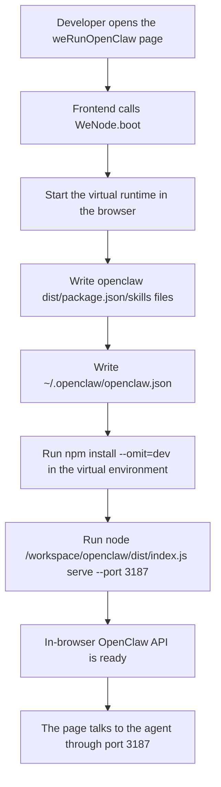

# BrowerClaw

[中文](README.md) | English

`BrowerClaw` is a demo repository that brings the `openclaw` runtime into the browser. It lets developers start an “in-browser OpenClaw service” directly from a frontend page, making it easier to debug the UI, verify skill-loading behavior, and inspect the browser runtime boot process.

It contains two subprojects:

- `openclaw/`: a trimmed, local-first agent runtime that provides core capabilities such as `agent`, `chat`, `serve`, and `skills`.
- `weRunOpenClaw/`: a React + Vite frontend that starts `weNode` in the browser and loads the built `openclaw` artifacts into a virtual filesystem.

## Fastest Developer Setup

### 1. Requirements

- Node.js `>=22.12.0`
- `pnpm >=10`
- A modern browser with `Web Workers` and `SharedArrayBuffer` support

Although `weRunOpenClaw` declares `Node >=18.18.0`, the full development flow depends on the built output from `openclaw`, so using **Node 22** across the repo is recommended.

### 2. Install Dependencies

```bash
cd openclaw
pnpm install

cd ../weRunOpenClaw
pnpm install
```

### 3. Build `openclaw` First

```bash
cd ../openclaw
pnpm build
```

This generates `openclaw/dist/`. Without this directory, the frontend can still start, but the virtual runtime inside the browser will not have an executable OpenClaw entrypoint.

### 4. Configure Frontend Environment Variables

```bash
cd ../weRunOpenClaw
cp .env.example .env.local
```

At minimum, confirm these variables are available:

- `VITE_OPENCLAW_GEMINI_BASE_URL`
- `VITE_OPENCLAW_GEMINI_API_KEY`
- `VITE_OPENCLAW_LAST_TOUCHED_AT`
- `VITE_OPENCLAW_LAST_TOUCHED_VERSION`

These values are written into the virtual `~/.openclaw/openclaw.json` file inside the browser runtime.

### 5. Start the Frontend

```bash
pnpm dev
```

Open:

- `http://localhost:5173`

On the first page load, the frontend boots the runtime, installs dependencies, and starts the service inside the browser. As a result, the first load is usually slower than a regular React page.

## How It Works

BrowserClaw is not a traditional “frontend calls a local backend” setup. Instead, it starts a runnable OpenClaw service directly inside the browser environment.

### Startup Flow



### Step-by-Step

1. The browser opens the `weRunOpenClaw` page.
2. The frontend calls `WeNode.boot()` to create the in-browser virtual runtime.
3. The frontend writes `openclaw/dist`, `openclaw/package.json`, `openclaw/skills/**`, template docs, and related files into the virtual filesystem.
4. The frontend writes runtime configuration such as `~/.openclaw/openclaw.json`.
5. The virtual runtime runs `npm install --omit=dev` to install the trimmed runtime dependencies.
6. It then runs `node /workspace/openclaw/dist/index.js serve --port 3187`.
7. The UI communicates with the agent through the in-browser virtual service on port `3187`.

## Why `openclaw` Must Be Built First

`weRunOpenClaw` does not import `openclaw/src` directly. It depends on the compiled output from `openclaw`. The development order is therefore fixed:

1. Install `openclaw` dependencies
2. Build `openclaw`
3. Start or build `weRunOpenClaw`

In short, the frontend “copies and starts” `openclaw/dist`; it does not replace the `openclaw` compilation step.

## Project Layout

```text
BrowerClaw/
├─ Dockerfile
├─ openclaw/         # TypeScript CLI/runtime
└─ weRunOpenClaw/    # Browser UI + weNode runtime host
```

## Ports and Runtime Constraints

- The `weRunOpenClaw` Vite dev server uses port `5173` by default.
- The in-browser OpenClaw API uses port `3187`.
- The page must send `COOP/COEP` response headers, otherwise `SharedArrayBuffer` / `weNode` cannot start.

These settings are currently handled in:

- `weRunOpenClaw/vite.config.ts`
- `Dockerfile`

## Browser Runtime Dependency Strategy

BrowserClaw does not install the full `openclaw` production dependency set inside `weNode`. Instead, it uses a **browser runtime dependency profile** to trim the runtime dependency list.

The goal is to:

- Keep only the browser-relevant chat, config, skill, and preview path
- Avoid server-side or channel-specific packages that trigger additional network installs
- Improve first-start reliability and reduce boot time

As a result, some server-oriented or channel-integration dependencies are excluded from the browser install set, including parts of the WhatsApp, Slack, and Telegram dependency paths, along with other heavy server-side packages.

## Common Commands

### `openclaw/`

```bash
pnpm build
pnpm test
pnpm lint
pnpm openclaw agent --message "Summarize this project"
pnpm openclaw serve --port 3187
```

### `weRunOpenClaw/`

```bash
pnpm dev
pnpm build
pnpm preview
pnpm typecheck
```

## Docker Build

The root `Dockerfile` does the following:

1. Installs dependencies for `openclaw` and `weRunOpenClaw`
2. Builds `openclaw`
3. Builds `weRunOpenClaw`
4. Serves `weRunOpenClaw/dist` with Nginx

Example:

```bash
docker build \
  --build-arg VITE_OPENCLAW_GEMINI_BASE_URL=https://your-model-host.example.com/v1 \
  --build-arg VITE_OPENCLAW_GEMINI_API_KEY=your-key \
  --build-arg VITE_OPENCLAW_LAST_TOUCHED_AT=2026-04-12T00:00:00.000Z \
  --build-arg VITE_OPENCLAW_LAST_TOUCHED_VERSION=2026.1.0 \
  -t browerclaw .

docker run --rm -p 8080:80 browerclaw
```

Open:

- `http://localhost:8080`

## Key Source Entrypoints

- `openclaw/src/index.ts`: CLI entrypoint
- `openclaw/src/agents/mini-agent.ts`: main implementation for `agent`, `chat`, `serve`, and `skills`
- `weRunOpenClaw/src/pages/BrowserClawPage.tsx`: main page and task/panel orchestration
- `weRunOpenClaw/src/ui/Terminal/weNodeBootstrap.ts`: in-browser `weNode + openclaw` bootstrap logic
- `weRunOpenClaw/vite.config.ts`: dev server and `COOP/COEP` configuration
- `Dockerfile`: production build and static deployment entrypoint

## FAQ

### The frontend starts, but OpenClaw does not run in the page. What should I check?

Check these first:

- Whether `pnpm build` has been run inside `openclaw/`
- Whether the browser supports `SharedArrayBuffer`
- Whether the response includes `Cross-Origin-Opener-Policy: same-origin`
- Whether the response includes `Cross-Origin-Embedder-Policy: credentialless`
- Whether the in-browser `npm install` was blocked by network policy during first load

### Why is the first page load slow?

The first load does more than fetch frontend assets. It also:

- Starts `weNode`
- Writes the virtual filesystem
- Installs runtime dependencies
- Starts `openclaw serve`

### Is the API key safe?

`VITE_OPENCLAW_GEMINI_API_KEY` is bundled into the frontend. For real production use, prefer a server-side proxy instead of exposing the key directly in the browser.

## Known Notes

- The repository usually does not include the latest `openclaw/dist/`, so build it before development.
- `weRunOpenClaw/dist/` cannot replace `openclaw/dist/`.
- The browser runtime performs a dependency install, so network conditions directly affect first-start success.
- The current implementation aims for a minimal runnable OpenClaw inside the browser, not a full replica of the server runtime environment.
